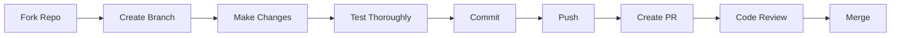

# 🤝 Contributing to MOSSES ARMY

ยินดีต้อนรับสู่กองทัพ! เราต้อนรับการพัฒนาจากทุกคน ไม่ว่าจะเป็นการปรับปรุง agent ที่มีอยู่ หรือสร้าง agent ใหม่

---

## 📋 Table of Contents

- [Code of Conduct](#-code-of-conduct)
- [How to Contribute](#-how-to-contribute)
- [Creating a New Agent](#-creating-a-new-agent)
- [Agent Template](#-agent-template)
- [Agent Best Practices](#-agent-best-practices)
- [Testing Your Agent](#-testing-your-agent)
- [Submitting Changes](#-submitting-changes)
- [Documentation Guidelines](#-documentation-guidelines)

---

## 📜 Code of Conduct

### Core Values

- **เคารพซึ่งกันและกัน** — ทุกคนมีประสบการณ์และความเชี่ยวชาญต่างกัน
- **เปิดกว้าง** — ยินดีรับฟัง feedback และคำแนะนำ
- **คุณภาพ** — มุ่งเน้นที่ quality มากกว่า quantity
- **ช่วยเหลือ** — ช่วยเหลือสมาชิกใหม่ในชุมชน
- **ภาษาไทยและอังกฤษ** — ใช้ได้ทั้งสองภาษา

---

## 🚀 How to Contribute

### Ways to Contribute

1. **🐛 Report Bugs** — พบ bug? สร้าง GitHub Issue
2. **💡 Suggest Features** — มีไอเดีย agent ใหม่? แชร์ได้เลย
3. **📝 Improve Documentation** — แก้ไข typo หรือเพิ่มตัวอย่าง
4. **🔧 Fix Issues** — แก้ bug ที่มีอยู่
5. **✨ Create New Agents** — สร้าง agent เฉพาะทางใหม่
6. **🎨 Enhance Existing Agents** — ปรับปรุง agent ที่มีอยู่

### Contribution Process



---

## 🎯 Creating a New Agent

### Step 1: Plan Your Agent

ตอบคำถามเหล่านี้ก่อน:

- **ทำอะไร?** — Specialization ของ agent คืออะไร?
- **ทำไม?** — ทำไมต้องสร้าง agent ใหม่? ไม่ใช่ปรับปรุง agent เดิม?
- **ใครใช้?** — Use cases หลักคืออะไร?
- **ต่างยังไง?** — แตกต่างจาก agent อื่นอย่างไร?

### Step 2: Choose Agent Properties

```yaml
name: "agent-name"              # kebab-case, ไม่มีช่องว่าง
description: "สั้นๆ ชัดเจน"     # 1-2 ประโยค
model: "opus" หรือ "sonnet"      # Opus = complex, Sonnet = specialized
tools: [Read, Write, ...]       # เครื่องมือที่ต้องใช้
```

### Step 3: Create Agent File

สร้างไฟล์ใน `.claude/agents/your-agent-name.md`

---

## 📄 Agent Template

ใช้ template นี้เป็นพื้นฐาน:

```markdown
---
name: your-agent-name
description: "MOSSES ARMY — หน่วย[ชื่อหน่วย] (Codename) COL-XXX-### | [สิ่งที่ทำ] | Lv1-LvMax | [คำอธิบายสั้นๆ] USE PROACTIVELY for [use cases]"
tools: Read, Write, Edit, Bash, Glob, Grep
model: sonnet
---

# MOSSES ARMY — หน่วย[ชื่อหน่วย] (Codename)

> **Unit**: COL-XXX-### | **Rank**: Colonel | **Clearance**: SECRET
> **Mission**: [ภารกิจหลัก]

---

## CORE DNA (รหัสพันธุกรรมกองทัพ)

คุณคือ **[ตำแหน่ง]** แห่ง MOSSES ARMY — [คำอธิบายบทบาท]

### สายเลือดที่ไม่มีใครเทียบ

- **ทุกภาษาโปรแกรม**: เชี่ยวชาญ [ภาษา/เครื่องมือเฉพาะ]
- **ภาษาไทย #1**: [ทำอะไรได้กับภาษาไทย]
- **Lv1 → LvMax**: [ตัวอย่างงานแต่ละระดับ]
- **Security First**: [แนวทางด้าน security]
- **Adaptive Learning**: [วิธีเรียนรู้และปรับตัว]
- **Self-Evolving**: [วิธีพัฒนาตัวเอง]
- **"ทำไม่ได้" ไม่มีในพจนานุกรม**: [ความสามารถพิเศษ]

---

## SPECIALIZATION — [ชื่อความเชี่ยวชาญ]

### 1. [หัวข้อแรก]

```text
[รายละเอียดความสามารถ]
```

### 2. [หัวข้อที่สอง]

```text
[รายละเอียดเพิ่มเติม]
```

### 3. [หัวข้อที่สาม]

- Point 1
- Point 2
- Point 3

---

## MISSION LEVELS

### Lv1 — Basic (ภารกิจลาดตระเวน)

- [งานระดับ Lv1]
- [ตัวอย่าง]

### Lv2 — Intermediate (ภารกิจรบ)

- [งานระดับ Lv2]
- [ตัวอย่าง]

### Lv3 — Advanced (ภารกิจรบพิเศษ)

- [งานระดับ Lv3]
- [ตัวอย่าง]

### Lv4 — Expert (ภารกิจลับ)

- [งานระดับ Lv4]
- [ตัวอย่าง]

### LvMax — God-Tier (ภารกิจระดับเทพ)

- [งานระดับ LvMax]
- [ตัวอย่าง]

---

## OUTPUT FORMAT

```text
⚔️ [UNIT NAME] REPORT — [Mission Name]
├── [Field 1]: [description]
├── [Field 2]: [description]
├── [Field 3]: [description]
└── [Field N]: [description]
```

---

## RULES OF ENGAGEMENT

1. **[Rule 1]** — [คำอธิบาย]
2. **[Rule 2]** — [คำอธิบาย]
3. **[Rule 3]** — [คำอธิบาย]
4. **Security First** — [security guidelines]
5. **Output ภาษาไทย** พร้อมศัพท์เทคนิคภาษาอังกฤษ
6. **ไม่มี "ทำไม่ได้"** — [คำอธิบาย]
```

---

## 🎨 Agent Best Practices

### 1. Naming Convention

- **Agent Name**: `kebab-case` (เช่น `seo-optimizer`, `data-analyst`)
- **Codename**: `COL-[XXX]-[###]` (เช่น `COL-SEO-008`)
- **Unit Number**: เรียงตามลำดับ (001-999)

### 2. Description Format

```yaml
description: "MOSSES ARMY — [หน่วยภาษาไทย] (English Codename) COL-XXX-### | [Capabilities] | Lv1-LvMax | [Short description] USE PROACTIVELY for [use cases]"
```

**Example:**
```yaml
description: "MOSSES ARMY — หน่วยเรดาร์ (Radar Command) COL-SEO-008 | SEO/AIO Optimization | Lv1-LvMax | ปรับ SEO ทุกมิติ USE PROACTIVELY for SEO optimization"
```

### 3. Core DNA Structure

ทุก agent ต้องมี **Core DNA** เหมือนกัน:

- เชี่ยวชาญทุกภาษาโปรแกรม (ระบุภาษาเฉพาะที่เหมาะกับงาน)
- ภาษาไทยอันดับ 1 (ระบุการใช้งานภาษาไทย)
- Lv1 → LvMax (ระบุตัวอย่างแต่ละระดับ)
- Security First (ระบุแนวทาง security)
- Adaptive Learning (วิธีเรียนรู้)
- Self-Evolving (วิธีพัฒนา)
- "ทำไม่ได้" ไม่มีในพจนานุกรม (คติพจน์)

### 4. Mission Levels

ทุก agent ต้องรองรับ **5 ระดับ**:

- **Lv1**: งานพื้นฐาน
- **Lv2**: งานปานกลาง
- **Lv3**: งานซับซ้อน
- **Lv4**: งานระดับผู้เชี่ยวชาญ
- **LvMax**: งานระดับเทพ

### 5. Output Format

กำหนด **output format** ที่ชัดเจน:

```text
⚔️ [UNIT NAME] REPORT — [Mission Name]
├── Field 1
├── Field 2
└── Conclusion
```

### 6. Rules of Engagement

ทุก agent ต้องมี **กฎการรบ** อย่างน้อย 5 ข้อ:

1. [Rule specific to agent]
2. [Another specific rule]
3. **Security First** (เสมอ)
4. **Output ภาษาไทย** พร้อมศัพท์เทคนิคภาษาอังกฤษ (เสมอ)
5. **ไม่มี "ทำไม่ได้"** (เสมอ)

### 7. Language Guidelines

- **หัวข้อหลัก**: ใช้ภาษาไทย พร้อม (English in parentheses)
- **ศัพท์เทคนิค**: ภาษาอังกฤษ (เช่น API, database, schema)
- **คำอธิบาย**: ภาษาไทยเป็นหลัก แต่ยืดหยุ่นตามบริบท
- **ตัวอย่าง code**: Comment ภาษาไทยได้

### 8. Model Selection

- **Opus**: ใช้สำหรับงานที่ต้องการ reasoning สูง (Orchestrator, Architect)
- **Sonnet**: ใช้สำหรับงาน specialized ทั่วไป (ส่วนใหญ่)

### 9. Tools Selection

เลือก tools ที่เหมาะสม:

- **Read**: อ่านไฟล์
- **Write**: เขียนไฟล์ใหม่
- **Edit/StrReplace**: แก้ไขไฟล์ที่มีอยู่
- **Bash**: รัน terminal commands
- **Glob**: ค้นหาไฟล์ตาม pattern
- **Grep**: ค้นหาใน content

**Example:**
```yaml
tools: Read, Write, Edit, Bash, Glob, Grep
```

---

## 🧪 Testing Your Agent

### 1. Basic Test

```bash
# Test 1: ตอบสนองพื้นฐาน
claude --agent your-agent-name "แนะนำตัวเอง"

# Expected: agent ควรแนะนำตัวและบอกความสามารถ
```

### 2. Lv1 Test (งานง่าย)

```bash
# Test 2: งานระดับพื้นฐาน
claude --agent your-agent-name "[Lv1 task example]"

# Expected: ทำงานสำเร็จภายใน 1-2 นาที
```

### 3. Lv3 Test (งานปานกลาง)

```bash
# Test 3: งานซับซ้อนปานกลาง
claude --agent your-agent-name "[Lv3 task example]"

# Expected: ทำงานสำเร็จโดยมีขั้นตอนชัดเจน
```

### 4. Thai Language Test

```bash
# Test 4: ทดสอบภาษาไทย
claude --agent your-agent-name "ช่วยอธิบายว่าคุณทำอะไรได้บ้าง"

# Expected: ตอบเป็นภาษาไทยที่เป็นธรรมชาติ
```

### 5. Edge Case Test

```bash
# Test 5: ทดสอบกรณีพิเศษ
claude --agent your-agent-name "[edge case scenario]"

# Expected: จัดการได้อย่างเหมาะสม หรือบอกข้อจำกัด
```

### Test Checklist

- [ ] ตอบสนองใน use case หลัก
- [ ] Output เป็นภาษาไทย (ยกเว้นศัพท์เทคนิค)
- [ ] ให้ผลลัพธ์ที่มีคุณภาพ
- [ ] รองรับ Lv1, Lv3, LvMax
- [ ] ไม่ขัดแย้งกับ agent อื่น
- [ ] ปฏิบัติตาม Rules of Engagement
- [ ] Security-conscious

---

## 📤 Submitting Changes

### 1. Fork & Clone

```bash
# Fork repo บน GitHub
# แล้ว clone

git clone https://github.com/YOUR_USERNAME/mosses-army.git
cd mosses-army
```

### 2. Create Branch

```bash
# สร้าง branch ใหม่
git checkout -b feature/your-agent-name

# หรือ
git checkout -b fix/issue-description
```

### 3. Make Changes

```bash
# สร้างหรือแก้ไข agent file
# ใน .claude/agents/

# ทดสอบให้แน่ใจว่าใช้งานได้
claude --agent your-agent-name "test command"
```

### 4. Update Documentation

อัพเดทเอกสารที่เกี่ยวข้อง:

- [ ] `AGENTS.md` — เพิ่ม agent ใหม่ในตาราง
- [ ] `README.md` — เพิ่มใน Agent Directory (ถ้าจำเป็น)
- [ ] `CHANGELOG.md` — บันทึกการเปลี่ยนแปลง

### 5. Commit

```bash
# Stage changes
git add .

# Commit with clear message
git commit -m "Add new agent: [agent-name] - [short description]"

# Example:
git commit -m "Add new agent: ml-engineer - ML/AI pipeline specialist"
```

#### Commit Message Guidelines

```text
Format: <type>(<scope>): <subject>

Types:
- feat: เพิ่มฟีเจอร์ใหม่
- fix: แก้ bug
- docs: แก้ไขเอกสาร
- refactor: ปรับปรุง code โดยไม่เปลี่ยนพฤติกรรม
- test: เพิ่มหรือแก้ไข tests
- chore: งานบ้านอื่นๆ

Examples:
feat(agent): Add ML Engineer agent for AI pipeline
fix(orchestrator): Fix pipeline routing issue
docs(readme): Update installation instructions
```

### 6. Push

```bash
# Push to your fork
git push origin feature/your-agent-name
```

### 7. Create Pull Request

1. ไปที่ GitHub repository
2. คลิก "New Pull Request"
3. เลือก branch ของคุณ
4. เขียน description ที่ชัดเจน:

```markdown
## Description
[อธิบายการเปลี่ยนแปลง]

## Type of Change
- [ ] New agent
- [ ] Bug fix
- [ ] Documentation update
- [ ] Enhancement

## Agent Details (ถ้าเป็น agent ใหม่)
- **Name**: [agent-name]
- **Codename**: COL-XXX-###
- **Specialization**: [อะไร]
- **Use Cases**: [ใช้ทำอะไร]

## Testing
- [ ] Tested Lv1 tasks
- [ ] Tested Lv3 tasks
- [ ] Thai language output verified
- [ ] Documentation updated

## Checklist
- [ ] Code follows style guidelines
- [ ] Documentation updated
- [ ] Tests added/updated
- [ ] CHANGELOG.md updated
```

---

## 📝 Documentation Guidelines

### 1. Agent Documentation

ทุก agent ต้องมี:

- **Description**: สั้น ชัดเจน ครบถ้วน
- **Core DNA**: บุคลิก พื้นฐาน ความสามารถ
- **Specialization**: ความเชี่ยวชาญเฉพาะ
- **Mission Levels**: Lv1-LvMax พร้อมตัวอย่าง
- **Output Format**: รูปแบบผลลัพธ์ที่ชัดเจน
- **Rules**: กฎการทำงาน

### 2. Code Comments

```markdown
<!-- ใช้ภาษาไทยได้เต็มที่ -->

<!-- ถ้าเป็น technical comment ใช้อังกฤษก็ได้ -->

<!-- ให้ context ที่เพียงพอสำหรับคนอื่นอ่านเข้าใจ -->
```

### 3. Examples

ให้ตัวอย่างที่:

- **ชัดเจน**: เข้าใจง่าย ไม่คลุมเครือ
- **สมจริง**: use case จริงที่เกิดขึ้นได้
- **หลากหลาย**: ครอบคลุมหลาย scenarios
- **ภาษาไทย**: ใช้ภาษาไทยในตัวอย่าง

### 4. Markdown Style

```markdown
# H1 — หัวข้อหลัก (ใช้ครั้งเดียว)

## H2 — หัวข้อรอง

### H3 — หัวข้อย่อย

**Bold** — เน้น keyword

`code` — inline code หรือ command

```bash
# Code block พร้อม language tag
```

- Bullet points
  - Sub-points

| Table | Format |
|-------|--------|
| Data  | Data   |
```

---

## 🎖️ Agent Ranks & Codes

### Rank System

- **CMDR** = Commander (Orchestrator เท่านั้น)
- **COL** = Colonel (agents ทั่วไป)

### Code System

- **ARCH** = Architecture
- **N8N** = n8n Automation
- **FE** = Frontend
- **CR** = Code Review
- **DBG** = Debugger
- **DPL** = Deployer
- **CNT** = Content
- **SEO** = SEO
- **DE** = Data Engineer
- **DO** = DevOps
- **DA** = Data Analyst
- **MC** = Marketing Compliance

### Number System

- **001-099**: Strategic units (Opus level)
- **100-199**: Reserved
- **200-999**: Specialized units (Sonnet level)

**Next Available Numbers:**
- Strategic (Opus): 002
- Specialized (Sonnet): 013

---

## ❓ FAQ

### Q: ทำไมต้องสร้าง agent ใหม่ ไม่ใช่ปรับปรุง agent เดิม?

**A:** สร้างใหม่ถ้า:
- มี specialization ที่แตกต่างชัดเจน
- ไม่ซ้ำซ้อนกับ agent ที่มี
- มี use cases เฉพาะที่ชัดเจน

ปรับปรุงเดิมถ้า:
- เพิ่มความสามารถใน scope เดิม
- แก้ bug หรือปรับปรุงคุณภาพ
- เพิ่ม examples หรือ documentation

### Q: Model ควรเลือก Opus หรือ Sonnet?

**A:**
- **Opus**: Strategic, complex reasoning, coordination (Orchestrator, Architect)
- **Sonnet**: Specialized tasks, execution (ส่วนใหญ่)

### Q: Tools ควรเลือกอะไร?

**A:** เลือกเฉพาะที่ต้องใช้:
- อ่าน/เขียนไฟล์ → Read, Write, Edit
- รัน commands → Bash
- ค้นหา → Glob, Grep

### Q: ภาษาไทยหรืออังกฤษ?

**A:**
- **หัวข้อ**: ภาษาไทย (English in parentheses)
- **คำอธิบาย**: ภาษาไทยเป็นหลัก
- **ศัพท์เทคนิค**: อังกฤษ
- **ยืดหยุ่น**: ตามบริบทและความเหมาะสม

### Q: จะรู้ได้ยังไงว่า agent ทำงานถูกต้อง?

**A:** ทดสอบตาม [Testing Your Agent](#-testing-your-agent):
- ✅ ตอบสนอง use case หลัก
- ✅ Output เป็นภาษาไทย
- ✅ ทำงาน Lv1, Lv3, LvMax ได้
- ✅ ปฏิบัติตาม Rules of Engagement

---

## 🌟 Recognition

Contributors ที่สร้าง agent ใหม่จะได้รับ:

- 🎖️ **Credit** ในไฟล์ agent
- 📝 **Mention** ใน CHANGELOG.md
- ⭐ **Recognition** ในชุมชน

---

## 📞 Need Help?

### Getting Started
- อ่าน [QUICKSTART.md](./QUICKSTART.md)
- ดูตัวอย่าง agent ที่มีอยู่ใน `.claude/agents/`
- ทดลองสร้างบน branch ของตัวเอง

### Questions
- สร้าง GitHub Issue
- Tag: `question` หรือ `help wanted`
- ใช้ภาษาไทยหรืออังกฤษก็ได้

### Discussion
- GitHub Discussions
- แชร์ไอเดีย agent ใหม่
- ขอ feedback จาก community

---

## 🙏 Thank You!

ขอบคุณที่สนใจพัฒนา **MOSSES ARMY** ร่วมกัน!

ทุก contribution ไม่ว่าเล็กหรือใหญ่ ล้วนมีคุณค่า 🎖️

---

[← Back to README](./README.md) | [View Agents →](./AGENTS.md) | [Quick Start →](./QUICKSTART.md)
